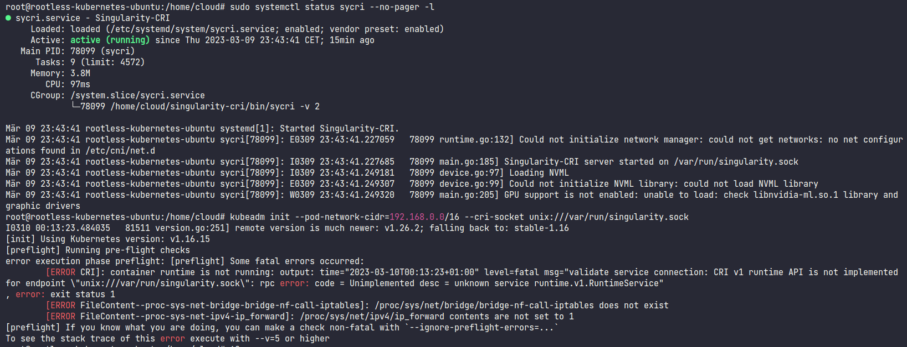

# Kubernetes Cluster based on Singularity

Set up a Kubernetes cluster using Singularity as the container runtime.

For this, a container runtime interface (CRI) for Singularity is needed. It adapts the Singularity container runtime in
a standardized way and therefore enables Kubernetes to use it. A (deprecated) implementation is available here: https://github.com/sylabs/singularity-cri

Ultimately, this should help us run Kubernetes workloads on HPC clusters.

## Setup

Install and set up Singularity, Singularity-CRI and Kubernetes:

``` shell
/bin/bash ./setup.sh
```
> So far only tried as root user on Ubuntu 22.04

## Notes & Errors

- In general, Kubernetes and Singularity continued evolving while Singularity-CRI was archived in December 2020
- If one tries to use Singularity-CRI with current implementation of Kubernetes and Singularity, multiple errors occur,
  so no functioning state could be achieved (March 2023 - Kubernetes 1.26 and SingularityCE 3.11.0)
    - Error when init Kubernetes cluster
    - Warning after starting Singularity-CRI service
      (we can prob. ignore this for now)
- If one tries to use old implementations from the time of the last Singularity-CRI release,
  same errors as with current implementation



## Sources

- https://slateci.io/blog/kubernetes-with-singularity.html
- https://docs.sylabs.io/guides/cri/1.0/user-guide/k8s.html
- https://github.com/sylabs/singularity-cri
- https://github.com/sylabs/wlm-operator/tree/master/vagrant
- https://github.com/sylabs/singularity
